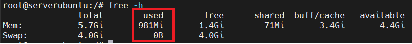
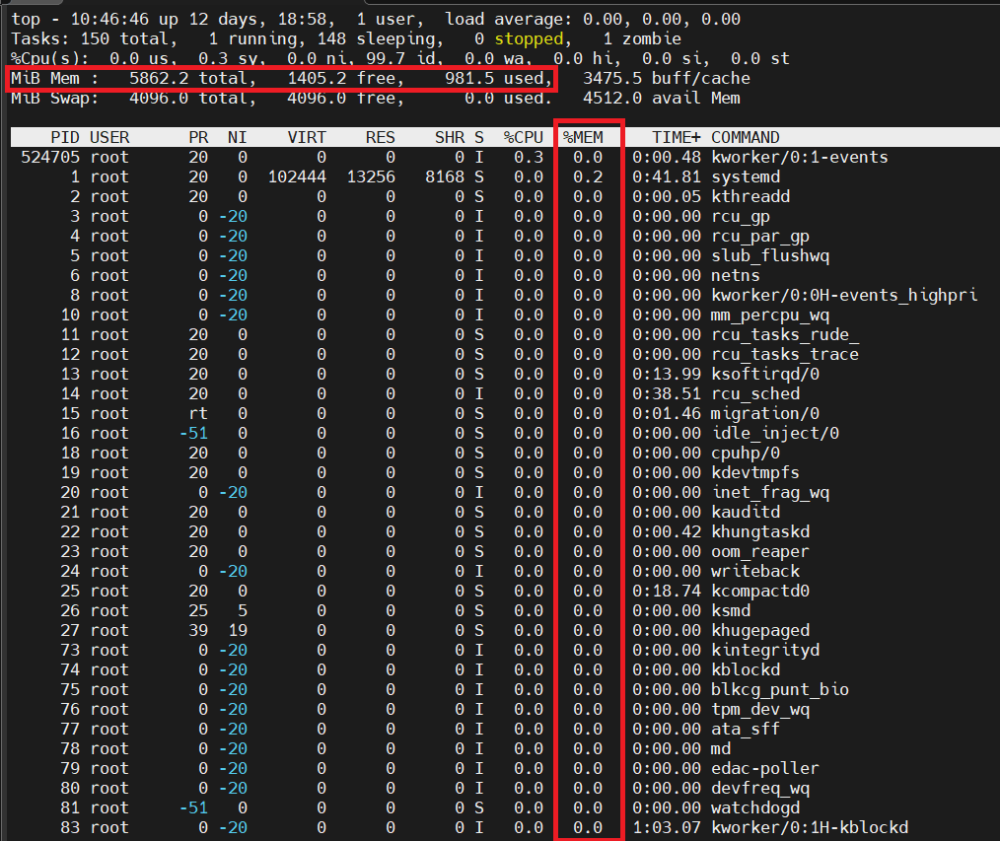
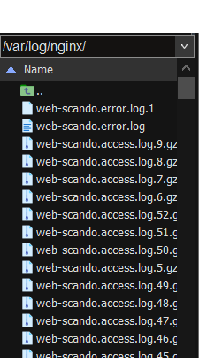

Provide your solution here:

*** Find the reason ***
Step 1: Check memory using - 
- Use CLI: "free -h" to check memory using present.

Step 2: Check process of aplication - 
- Use comment 'top'

Step 3: Check log at path ./var/log/nginx - 
- Check file log.access and log.error
- Check count of request from log file -> Maybe DDoS attacker

*** Solution ***
Solution 1: Auto-reboot scheduler configuration for Nginx.
Solution 2: Upgrade resource if necessary
